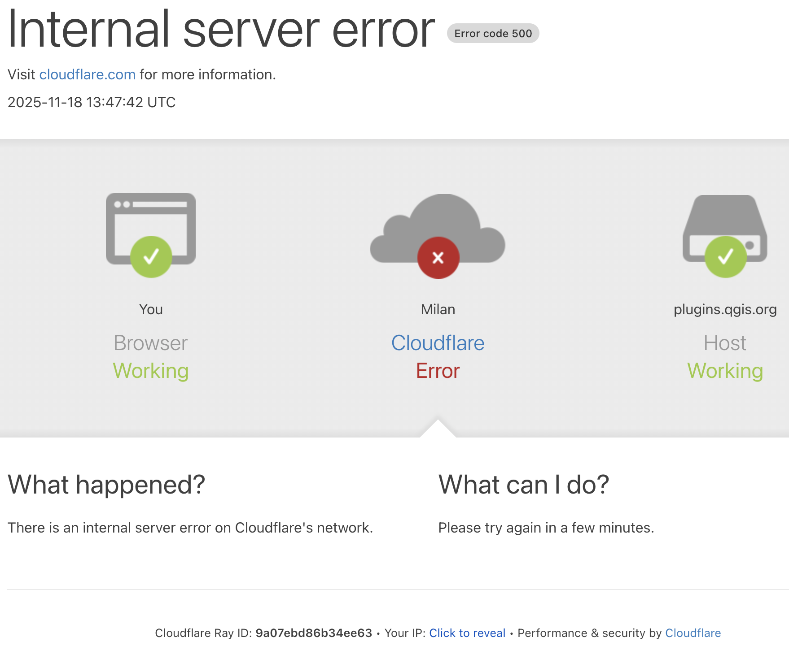

### links
- Microsoft Visual Studio [Code](https://code.visualstudio.com/)
- [QT Creator](https://www.qt.io/product/development-tools)
- QGIS [plugins](https://plugins.qgis.org/) 
- QGIS plugin by [pyqgis](https://docs.qgis.org/latest/en/docs/pyqgis_developer_cookbook/plugins/index.html)
- [QGIS Minimalist Plugin Skeleton](https://github.com/wonder-sk/qgis-minimal-plugin?tab=readme-ov-file#qgis-minimalist-plugin-skeleton)
- [QGIS Plugin Builder](https://g-sherman.github.io/Qgis-Plugin-Builder/)
- Python [GUIs](https://www.pythonguis.com/)
- [mklink](https://learn.microsoft.com/en-us/windows-server/administration/windows-commands/mklink)
- VS Code [setup](https://gitlab.com/-/snippets/2207406)


###  Plugin Builder Output

__Plugin Builder Results__

Congratulations! You just built a plugin for QGIS!
  2
  
Your plugin __GisDay__ was created in:  
  __~/lab/qgis/plugins/gis_day__   
Your QGIS plugin directory is located at:
  __~/.local/share/QGIS/QGIS3/profiles/default/python/plugins__  

__What's Next__  
1. If resources.py is not present in your plugin directory, compile the resources file using pyrcc5 (simply use __pb_tool__ or __make__ if you have automake) 
2. Optionally, test the generated sources using __make test__ (or run tests from your IDE) 
3. Copy the entire directory containing your new plugin to the QGIS plugin directory (see Notes below) 
4. Test the plugin by enabling it in the QGIS plugin manager 
5. Customize it by editing the implementation file __gis_day.py__ 
6. Create your own custom icon, replacing the default __icon.png__ 
7. Modify your user interface by opening __gis_day_dialog_base.ui__ in Qt Designer 

Notes:   
- You can use __pb_tool__ to compile, deploy, and manage your plugin. Tweak the pb_tool.cfg file included with your plugin as you add files. Install __pb_tool__ using pip or easy_install. See __http://loc8.cc/pb_tool__ for more information. 
- You can also use the __Makefile__ to compile and deploy when you make changes. This requires GNU make (gmake). The Makefile is ready to use, however you will have to edit it to add addional Python source files, dialogs, and translations. 

For information on writing PyQGIS code, see __http://loc8.cc/pyqgis_resources__ for a list of resources. 

©2011-2019 GeoApt LLC - geoapt.com 

```
ln -s ~/lab/qgis/plugins/gis_day ~/.local/share/QGIS/QGIS3/profiles/default/python/plugins/gis_day

mklink /D "<link>" "<target>"
```